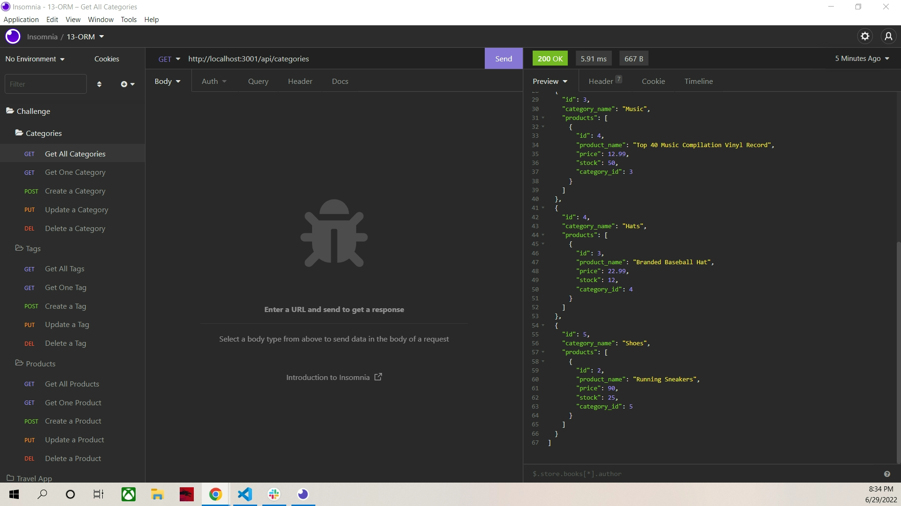

# E-commerce Back End

## Table of Contents
1. [Description](#description)
2. [Usage](#usage)
3. [Installation](#installation)
4. [Visuals](#visuals)
5. [Resources](#resources)

## Description

A back end database interface that utilizes MySQL2, Sequelize, Express.js, and dotenv to get, post, put, and delete requests.

## Usage

After launching the server, user can make requests of the database by using Insomnia. Use localhost:3001 for requests.

## Installation

After cloning the repo, run npm install, then run mysql -u root to open the mysql shell. From there, run source db/schema.sql; to create the database. Then exit and run npm run seed to seed the database. Afterwards, launch the server with nodemon. User can then use Insomnia to make requests.

## Visuals

A shot of the Insomnia feedback for getting all categories

## Resources
- [Repository](https://github.com/kleylakb89/13-Ecommerce-Back-End)
- [Walkthrough Video](https://drive.google.com/file/d/18X0qUC-o0d0NHAAzwy4U5tK9MjzQBJA0/view)